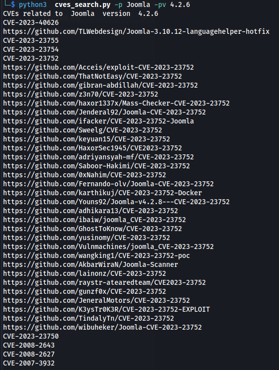
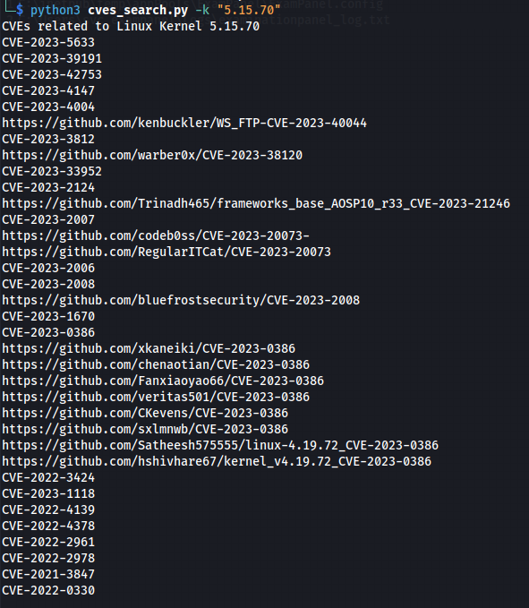

# cves_search
This script :
1. Find public github exploits related to a specific product and version
1. Find public github exploits related to a particular CVE
2. Take the kernel version of Linux, find CVEs associted with that version than can be used for **privilege escalation** on NIST vulnerability database and find public exploits on github associated with each CVE identified

## How to run 
### Find public github exploits related to a specific product and version

### Find public github exploits related to a particular CVE

  
### Find public github exploits for privilege escalation related to a linux kernel 
- Get the Linux kernel version using `uname -v`
  
  
- Submit the version to the script
  
  
