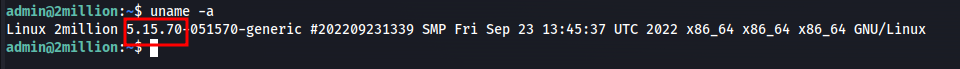
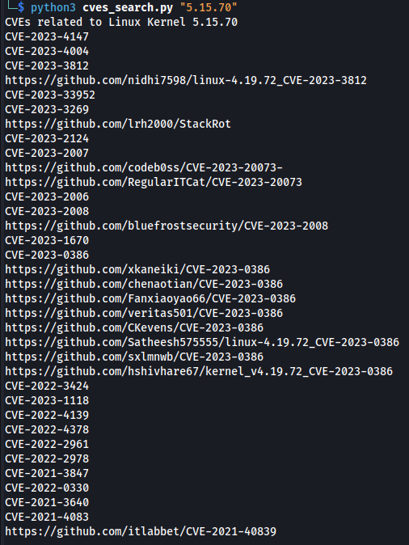

# linux_kernel_cves_search
This script takes the kernel version of Linux and:
1. Find CVEs associted with that version than can be used for **privilege escalation** on NIST vulnerability database
2. Find public exploits on github associated with each CVE identified

## How to run 
- Get the Linux kernel version using `uname -v`
  
- Submit the version to the script
  
